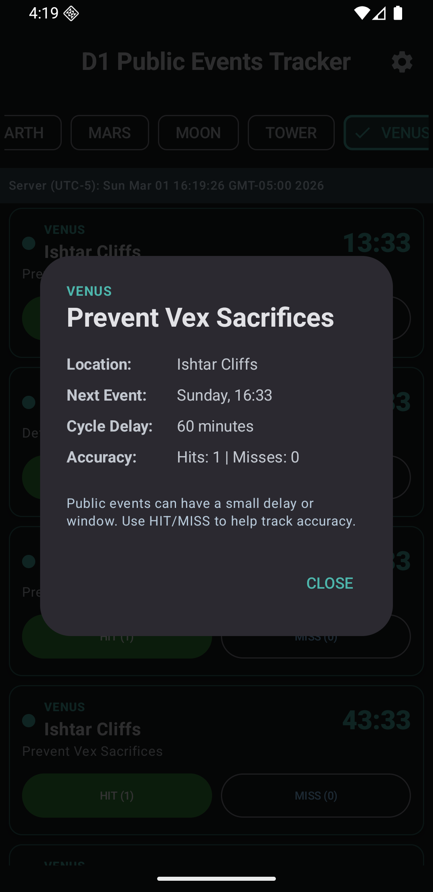
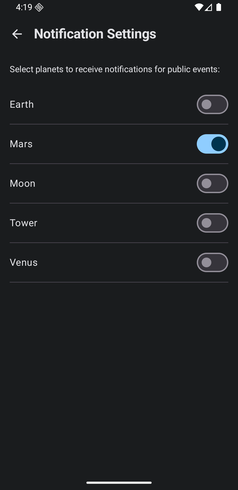
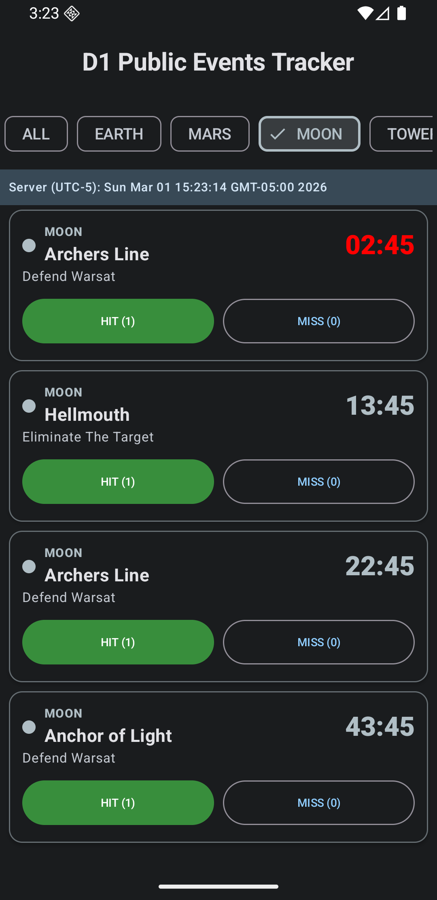

# DTracker: Destiny 1 Public Events Tracker

DTracker is an Android application designed to help Destiny 1 players track public events across various planets. It provides real-time countdowns for upcoming events, allows users to log successes and misses, and offers customizable notifications to ensure players never miss an event.

## Features

- **Real-time Event Tracking**: View upcoming public events with dynamic countdowns.
- **Planet Filtering**: Filter events by planet to focus on relevant locations.
- **Event Accuracy**: Track hit and miss rates for each event.
- **Detailed Event Information**: Tap on any event to see detailed descriptions, next occurrence times, and accuracy statistics.
- **Customizable Notifications**: Receive notifications for events on specific planets, configurable via a dedicated settings screen.
- **Modular Architecture**: Built with a clean, modular codebase for easy maintenance and future expansion.

## Screenshots

Here are some screenshots showcasing the application's interface:

### Main Event List


_Displays a list of public events, filterable by planet, with real-time countdowns._

### Event Details Dialog


_Shows detailed information about a specific public event upon tapping its card._

### Notification Settings


_Allows users to enable or disable notifications for public events on each planet._

## How to Run

To run DTracker on your local machine, follow these steps:

1.  **Clone the repository:**
    ```bash
    git clone https://github.com/your-username/DTracker.git
    cd DTracker
    ```
2.  **Open in Android Studio:**
    Open the project in Android Studio. Ensure you have the latest stable version of Android Studio and the Android SDK.
3.  **Sync Gradle:**
    Android Studio should automatically prompt you to sync Gradle. If not, click "Sync Project with Gradle Files" from the toolbar.
4.  **Run on a device or emulator:**
    Select a connected Android device or an emulator and click the "Run" button in Android Studio.

## Technologies Used

-   **Kotlin**: Primary programming language.
-   **Jetpack Compose**: For building the native Android UI.
-   **Gradle Kotlin DSL**: For build automation.
-   **Gson**: For JSON serialization/deserialization for SharedPreferences.
-   **AndroidX Libraries**: Modern Android development libraries.
-   **Google Fonts**: For custom typography in the application.

## Contributing

Feel free to fork the repository, open issues, or submit pull requests.

## License

This project is licensed under the MIT License - see the LICENSE file for details.
